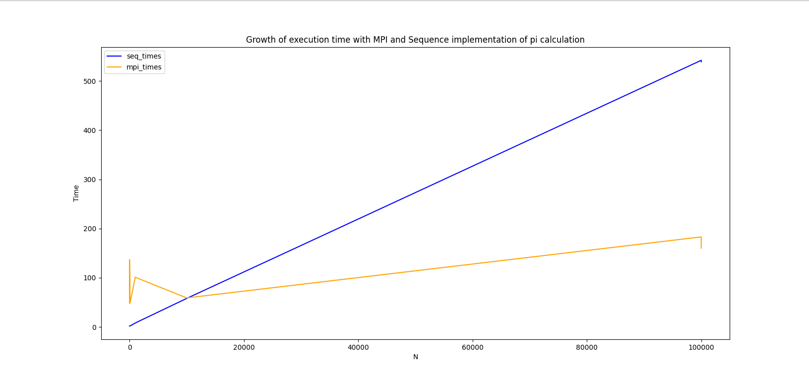

## Difference between MPI and sequential calculation of pi

#### How to run?

```bash
sudo chmod +x ./main.bash
```
```bash
python3 main.py
```

#### Output
| execution type | pi | error | system time unit | n |
|----------------|----|-------|--------------|---|
| Seq execution  | 3.4641016151377544| 0.3225089615479613 | 1 | 1 |
| MPI execution | 3.4641016151377544 | 0.3225089615479613 | 52 | 1 |
| Seq execution | 3.1524114332616446 | 0.0108187796718515 | 2 | 10 |
MPI execution | 3.1524114332616442 | 0.0108187796718511 | 128 | 10 |
| Seq execution | 3.1419368579000082 | 0.0003442043102151 | 2 | 100 |
| MPI execution | 3.1419368579000082 | 0.0003442043102151 | 187 | 100 |
| Seq execution | 3.1416035449129063 | 0.0000108913231132 | 6 | 1000 |
| MPI execution | 3.1416035449129023 | 0.0000108913231092 | 55 | 1000 |
| Seq execution | 3.1415929980246311 | 0.0000003444348380 | 58 | 10000 |
| MPI execution | 3.1415929980246404 | 0.0000003444348473 | 68 | 10000 | 
| Seq execution | 3.1415926644818297 | 0.0000000108920366 | 436 | 100000 |
| MPI execution | 3.1415926644818448 | 0.0000000108920517 | 180 | 100000 |




